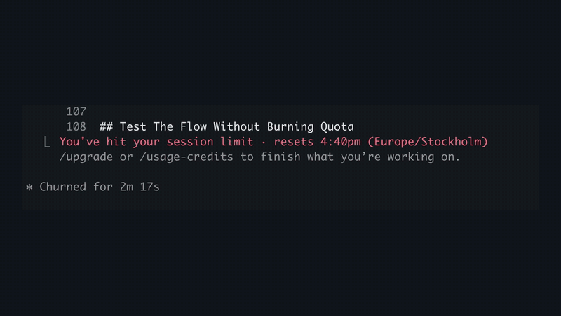

# cc-session-recover

**AFK mode for Claude Code.**

Start a long Claude Code task, walk away, sleep, hit quota, close the terminal,
come back later, the task still knows where it was and how to continue.

- ✅ No `tmux` injection
- ✅ Exact-session resume
- ✅ `HANDOFF.md` written to disk
- ✅ Resume: `Read HANDOFF.md and continue`

[](docs/assets/cc-session-recover-demo.mp4)

Example: My Claude Code quota stopped on June 12, scheduled attempts waited, then Claude continued after the reset. No babysitting

## Install

```sh
npx cc-session-recover init /path/to/project
```

(Or from a clone: `bash scripts/install-into-project.sh /path/to/project`. Pass `--no-hooks` with either to install the files without activating anything.)

Approve the hooks once when Claude Code asks on the next start. That's the whole setup.

## Use

```sh
cd /path/to/project
claude
```

Give Claude your task, normally. Nothing extra to type — the injected standing instructions make Claude keep the recovery note and set its own retry schedule. Leave the terminal open and walk away.

If quota dies mid-task, work resumes automatically after the reset.

## Why This Approach Is Stronger

- It avoids `tmux`, `screen`, and terminal-injection hacks. Headless `claude -p --resume` is used only by the optional closed-terminal watcher, targeting the exact recorded session.
- It gives you two recovery paths. With the terminal open, the heartbeat resumes inside the active Claude Code session. With the terminal closed, the watcher resumes the saved session id.
- `HANDOFF.md` keeps the next step in the repo, with project state, recent progress, and the exact next action.
- The heartbeat runs inside the active Claude Code session, so the original context stays alive while quota is blocked.

## Limits

- It does not bypass quota. It only waits for the reset.
- The basic flow needs the terminal to stay open. A closed-terminal recovery mode exists; see the docs.
- Worst case is never lost work: the recovery note is always on disk, and "Read HANDOFF.md and continue" restores any session by hand.
- Prompt injection frequency defaults to every prompt. Set `CC_REMIND_MODE=N` to limit to the first N prompts per session. See [Full details](docs/claude-code-auto-resume.md#tuning-prompt-injection-frequency).

## Docs

- [Simple flow](https://github.com/softcane/cc-session-recover/blob/main/docs/simple-flow.md) — how it works, told as a story (notebook, alarm, watchman).
- [FAQ](https://github.com/softcane/cc-session-recover/blob/main/docs/faq.md) — reliability, hook approval, what still needs a human.
- [Full details](https://github.com/softcane/cc-session-recover/blob/main/docs/claude-code-auto-resume.md) — closed-terminal watcher, precise reset-time resume, all limits.
