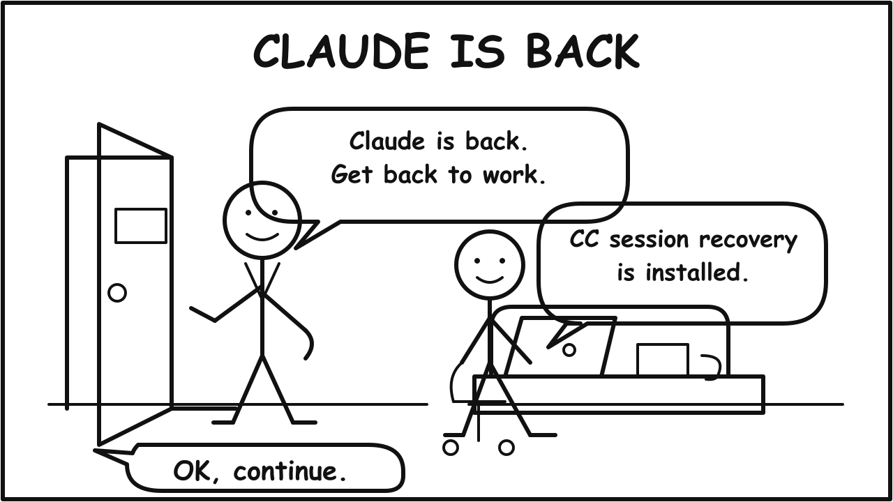

# cc-session-recover

Claude Code stopped at 1 AM. The quota reset passed. Your terminal still waited
for one word:

```text
continue
```

`cc-session-recover` gives Claude Code a recovery plan before you walk away. It
installs a `StopFailure` hook, a `/session-recover` command, a `HANDOFF.md`
notebook, and an optional watcher. When Claude Code hits a rate limit or
overload, the hook records the failure. After the retry window passes, the armed
session reads the handoff and continues the task.

No tmux tricks. No hidden prompt injection. No OS hacks.



[](docs/assets/cc-session-recover-demo.mp4)

The demo shows Claude Code hitting a real quota stop on June 12, waiting through
the reset, and continuing the same task.

## Install

Install into your Claude Code project:

```sh
npx cc-session-recover init /path/to/project
```

Install from a clone of this repo:

```sh
bash scripts/install-into-project.sh /path/to/project
```

Claude Code asks you to approve the hook command the next time you open that
project. The installer keeps an existing `HANDOFF.md` or
`session-recover.yaml`.

Pass `--no-hooks` if you want to copy the files without merging hook settings
into `.claude/settings.local.json`.

## Use It

Start Claude Code in the project:

```sh
cd /path/to/project
claude
```

Give Claude Code the task, then arm recovery:

```text
/session-recover
```

Use a custom check interval when you want one:

```text
/session-recover 15
```

The default interval is 30 minutes. Claude Code creates one recurring in-session
schedule with this prompt:

```text
Read .claude/auto-continue.md and follow it.
```

Keep that Claude Code session open. The schedule checks the task while the
session sits idle, then continues, waits, or stops.

## Claude Is Back

Someone else says "Claude is down." You keep your lunch, meeting, or overnight
run intact because the project already has three pieces of recovery state:

- `HANDOFF.md` tells Claude Code what changed and what to do next.
- `.claude/quota-blocked.json` records the transient failure and retry window.
- The recovery schedule checks the marker and resumes from the handoff after
  the window opens.

The installed runtime prints one of three states:

- `WAIT <seconds> <error>` means the retry window has not opened.
- `READY <error>` means Claude Code can clear the marker and continue.
- `NONE` means no pending failure exists, so Claude Code checks `HANDOFF.md`
  for remaining work.

Claude Code cancels the recovery schedule and prints `DONE` after the handoff
checklist finishes.

## If The Terminal May Close

Run the watcher from another shell:

```sh
npx cc-session-recover watch /path/to/project
```

The watcher reads the same marker file and resumes with:

```sh
claude -p --resume <session_id>
```

Use the in-session `/session-recover` schedule or the watcher. Do not run both on
the same project unless you want two Claude Code sessions editing the same files.

## Default Config

The installer creates this `session-recover.yaml`:

```yaml
errors:
  - rate_limit
  - overloaded

retry_minutes: 20
```

New installs retry `rate_limit` and `overloaded`. The runtime logs
`server_error`, but it will not retry that error until you add it:

```yaml
errors:
  - rate_limit
  - overloaded
  - server_error

retry_minutes: 10
```

Claude Code chooses the typed `StopFailure` name. Some Claude Code versions
report controlled HTTP 529 responses as `server_error`; add that name if you
want recovery for that classification.

For rate limits, a valid cached reset time wins over `retry_minutes`. Overload
and server-error recovery use `retry_minutes`.

## Installed Files

The installer adds:

- `.claude/session-recover.js`, the local runtime.
- `.claude/hooks/log-stop-failure.sh`, the `StopFailure` hook.
- `.claude/commands/session-recover.md`, the slash command.
- `.claude/auto-continue.md`, the recovery prompt.
- `.claude/statusline-quota-cache.sh`, the rate-limit reset cache.
- `HANDOFF.md`, the task notebook.
- `session-recover.yaml`, the retry config.

It also adds runtime state files to `.gitignore` so recovery logs and markers do
not enter your repo history.

## Limits

- This package does not bypass quota or provider failures.
- Same-session recovery needs the Claude Code process to stay open.
- Authentication, billing, invalid-request, model-not-found, and unknown errors
  stay out of the retry loop.
- The watcher needs `jq`, Node.js, and the `claude` command on `PATH`.
- You still need to review the finished work.

## Docs

- [Simple flow](https://github.com/softcane/cc-session-recover/blob/main/docs/simple-flow.md):
  notebook, alarm, and watcher.
- [FAQ](https://github.com/softcane/cc-session-recover/blob/main/docs/faq.md):
  hook approval, failure types, and what still needs a human.
- [Full details](https://github.com/softcane/cc-session-recover/blob/main/docs/claude-code-auto-resume.md):
  watcher timing, reset-time cache, and operational limits.
